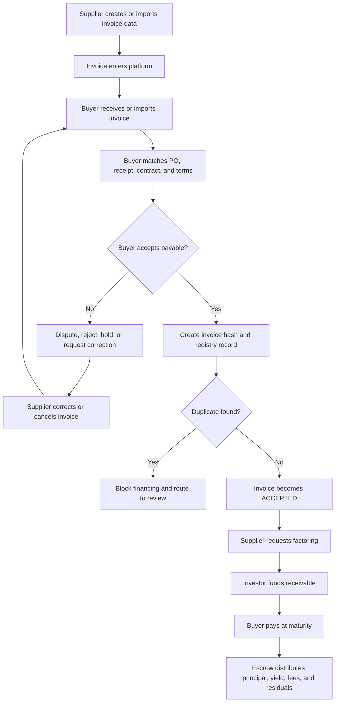
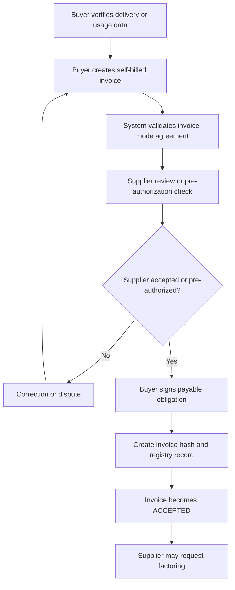

# Product Specifications: Verity

## 1. Product Summary

### 1.1 Product Name

**Verity**

### 1.2 Product Category

On-chain supply chain finance, receivables factoring, and programmable settlement platform.

### 1.3 Objective

Build a configurable Supply Chain Finance (SCF) platform where suppliers can convert buyer-accepted receivables into early liquidity, investors can fund verified payables with transparent risk-adjusted yield, and buyers can validate obligations and settle through fiat, stablecoin, or hybrid payment rails.

The platform uses structured invoice data, buyer validation, anti-duplicate registration, programmable wallets, USDC settlement, escrow logic, and auditable risk states to reduce friction in working-capital finance.

### 1.4 Core Product Thesis

```
Not every invoice is financeable.
An invoice becomes financeable only after it reaches confirmed Due Value:
evidence-backed, buyer-accepted, risk-mode assigned, and settlement-ready.
```

## 2. Market Problem

Traditional SCF and factoring suffer from recurring structural problems:

| Problem | Business impact | Platform response |
| --- | --- | --- |
| Double financing | Same invoice may be pledged to multiple funders. | Deterministic invoice hash and registry checks. |
| Weak invoice truth | Supplier invoice may not match delivery, PO, contract, or buyer approval. | Value-state workflow and buyer acceptance. |
| Buyer default | Investor funds supplier but buyer fails to pay at maturity. | Credit ceilings, risk modes, reserves, collateral, and default automation. |
| Slow settlement | Cross-border payments and bank rails delay working capital. | Stablecoin escrow and optional fiat/stablecoin hybrid settlement. |
| Poor SME visibility | Suppliers lack portable payment and performance history. | Verifiable profiles and settlement history. |

## 3. Actors

| Actor | Description | Primary goals |
| --- | --- | --- |
| Supplier / SME | Seller of goods or services with receivables. | Issue or review invoices, request early payment, track settlements. |
| Buyer / Anchor Enterprise | Purchaser whose payable backs the receivable quality. | Validate invoices, confirm obligations, manage maturity schedule. |
| Investor / Factor | Provides early liquidity against accepted receivables. | Select risk-adjusted opportunities, fund invoices, earn yield. |
| Platform Operator | Operates registry, risk policies, integrations, and compliance workflows. | Prevent duplicate financing, enforce state rules, maintain trust. |
| Settlement Infrastructure | Circle/USDC, wallets, bridges, fiat rails, escrow contracts. | Move value and record settlement events. |

## 4. Value Resolution Model

The platform is based on a value-state machine rather than a simple invoice-upload workflow.

| Value state | Buyer meaning | Supplier meaning | SCF meaning |
| --- | --- | --- | --- |
| `REQUESTED` | Buyer requests goods/services through PO or contract. | Supplier receives commercial demand. | Not financeable. |
| `DELIVERED` | Buyer receives goods/services or milestone evidence. | Supplier has performed obligation. | Evidence exists. |
| `ASK_VALUE` | Supplier asks buyer to pay through invoice issuance. | Supplier formalizes AR claim. | Invoice exists but is not financeable. |
| `MATCHED` | Invoice matches PO, receipt, contract, and tolerance rules. | Claim is supported by evidence. | Potentially stronger, but not yet buyer obligation. |
| `DUE_VALUE` | Buyer confirms payable obligation. | Supplier has collectible claim. | Financeable receivable can be created. |
| `FACTORED` | Buyer still owes maturity payment. | Supplier receives advance. | Investor holds financed exposure. |
| `SETTLED` | Buyer pays obligation. | Supplier/investor settlement is complete. | Contract state closes. |

Core rule:

```
ASK_VALUE must pass through matching and buyer acceptance before it becomes DUE_VALUE.
```

## 5. Invoice Modes

Invoice mode is negotiated between supplier and buyer. It may be configured at relationship, contract, purchase order, or invoice level.

| Invoice mode | Creator | Description | MVP support |
| --- | --- | --- | --- |
| Supplier-issued invoice | Supplier | Supplier creates invoice after delivery or service completion. | Primary mode. |
| Buyer-created invoice / self-billing | Buyer | Buyer creates invoice-like payable from verified buyer data. | Documented alternative; controlled rollout. |

### 5.1 Supplier-Issued Invoice Intake

Supplier-issued invoices can enter the platform without requiring PDF upload.

| Intake channel | Description | PDF required |
| --- | --- | --- |
| Supplier manual entry | Supplier enters structured invoice data in portal. | No |
| Supplier ERP/AP/AR import | Supplier imports invoice data through API, CSV, XML, EDI, or connector. | No |
| Supplier optional PDF | Supplier attaches PDF as evidence. | Optional |
| Buyer ERP/AP import | Buyer imports supplier invoice already captured in buyer AP system. | No |
| Buyer PDF upload | Buyer uploads supplier invoice PDF for extraction and validation. | Yes for this channel only |

Product rule:

```
Structured invoice data is the workflow source of truth.
PDF is supporting evidence unless policy or jurisdiction requires document-first intake.
```

### 5.2 Buyer-Created Invoice / Self-Billing

Self-billing is allowed only under an explicit invoice-mode agreement.

Valid use cases:

- Buyer controls verified quantity, usage, logistics, or delivery data.
- Contract pricing is formula-based.
- High-volume recurring settlement makes supplier-side invoicing inefficient.
- Evaluated receipt settlement is agreed.
- Supplier pre-authorizes buyer-generated invoice records.

Controls:

- Require `invoiceModeAgreementId`.
- Record whether supplier acceptance is explicit, pre-authorized, or waived by contract.
- Link buyer-created invoice to PO, receipt, contract, usage, or delivery evidence.
- Apply the same financing rules after acceptance.

## 6. Invoice Financeability

### 6.1 Seller-Issued Invoice Types

| Invoice type | Description | Financeability |
| --- | --- | --- |
| Draft invoice | Seller-created but not submitted. | Not financeable. |
| Submitted invoice | Issued to buyer, not reviewed. | Not financeable in MVP. |
| Evidence-linked invoice | References PO, contract, delivery, or service approval. | Advanced recourse-only candidate. |
| Matched invoice | Matches PO, receipt, contract, and tolerance rules. | Advanced restricted candidate. |
| Buyer-accepted invoice | Buyer confirms amount, due date, beneficiary, and payable. | Financeable. |
| Partially accepted invoice | Buyer accepts only part of invoice amount. | Accepted amount only. |
| Adjusted invoice | Corrected through credit memo, debit memo, or revision. | Latest accepted version only. |
| Disputed invoice | Buyer rejects or requests correction. | Not financeable. |
| Overdue invoice | Due date passed without payment. | Workout/special servicing only. |

### 6.2 Financeability Rule

MVP financing is allowed only when:

- Invoice status is `ACCEPTED`.
- Buyer has confirmed payable obligation.
- Duplicate check passes.
- Financing is enabled by buyer relationship policy.
- Settlement beneficiary is verified.
- Risk mode is assigned.
- Invoice has not been financed before.

## 7. Core Workflows

### 7.1 Supplier-Issued Invoice Flow



### 7.2 Buyer-Created Self-Billing Flow



### 7.3 Factoring and Settlement Flow

1. Supplier selects an accepted invoice and requests financing.
2. Platform evaluates invoice type, buyer rating, supplier history, maturity, concentration, and risk mode.
3. Investor reviews discount yield, annualized yield, recourse terms, reserve, and settlement rail.
4. Investor funds the receivable.
5. Escrow pays advance amount to supplier.
6. Retention/reserve remains locked if applicable.
7. Buyer pays full amount at maturity.
8. Escrow routes principal and yield to investor.
9. Remaining retention balance, minus fees or loss adjustments, returns to supplier.
10. Invoice state becomes `SETTLED`.

## 8. Risk Modes

| Risk mode | Supplier exposure | Investor exposure | Typical use |
| --- | --- | --- | --- |
| Full recourse | Supplier repays if buyer does not pay. | Lower exposure. | Incomplete evidence or weaker buyers. |
| Partial recourse | Supplier covers first-loss layer. | Moderate exposure. | Medium-risk accepted invoices. |
| Representation and warranty recourse | Supplier covers fraud, invalidity, duplicate assignment, dilution, and document breach. | Buyer credit risk mostly held by investor. | Default for accepted payables. |
| Non-recourse | Investor assumes buyer non-payment risk, subject to exclusions. | Higher exposure. | Strong buyer, clean accepted payable. |
| Reserve-backed non-recourse | Losses supported by reserve pool, insurance, buyer collateral, or supplier collateral. | Structurally reduced exposure. | Larger or institutional deals. |
| Workout/special servicing | Collection or restructuring process. | Case-specific. | Overdue or distressed invoices. |

MVP default:

```
Representation-and-warranty recourse against supplier
+ investor/factor takes buyer credit risk
+ optional reserve-backed protection for selected buyers.
```

## 9. Buyer Default Mitigation

### 9.1 Tier 1: Prevention

| Mechanism | Requirement |
| --- | --- |
| Buyer onboarding and KYB | Validate legal entity, jurisdiction, ownership, and payment authority. |
| Credit profile | Score buyer based on payment history, external credit data, sector, and concentration. |
| Programmatic credit ceiling | Cap outstanding financed exposure per buyer. |
| Invoice-level eligibility | Block financing for disputed, unmatched, duplicate, or overdue invoices. |
| Verifiable payment history | Update buyer profile after each on-time, late, or defaulted settlement. |

### 9.2 Tier 2: Structural Protection

| Mechanism | Requirement |
| --- | --- |
| Buyer collateral vault | Optional collateral requirement for higher-risk buyers. |
| Supplier first-loss reserve | Configurable reserve for selected risk tiers. |
| Ecosystem reserve fund | Portion of platform fees can fund default reserve. |
| Retention amount | Part of invoice face value can remain locked until maturity/dispute window. |

### 9.3 Tier 3: Default Resolution

Default trigger:

```
if escrowReceived < requiredSettlementAmount
and currentTime > maturityDate + gracePeriod
then status = DELINQUENT
```

Default actions:

- Freeze new financing for delinquent buyer.
- Flag buyer profile as `DELINQUENT`.
- Trigger collateral, reserve, or recourse waterfall.
- Notify investor, supplier, buyer, and platform operator.
- Route unresolved events to dispute, collection, or legal workflow.

## 10. Yield Model

Investor yield is a receivables discount yield. It must be shown as both deal-level discount and time-adjusted return.

| Metric | Meaning |
| --- | --- |
| Invoice face value | Amount due from buyer at maturity. |
| Advance amount | Amount paid early to supplier. |
| Discount fee | Face value minus advance amount, adjusted for reserve and platform fees. |
| Simple discount rate | Discount fee divided by face value. |
| Annualized yield | Simple return adjusted for invoice tenor. |
| Expected loss-adjusted yield | Gross yield minus expected credit/dilution/operational loss. |
| Net investor yield | Investor yield after platform fees, reserves, and settlement costs. |

Yield drivers:

- Buyer credit risk.
- Invoice state and evidence quality.
- Risk mode and supplier recourse.
- Maturity/tenor.
- Concentration limits.
- Payment rail and currency.
- Reserve, collateral, or insurance support.
- Historical dispute, dilution, and default rate.

## 11. Payment and Settlement Modes

| Payment mode | Description | MVP position |
| --- | --- | --- |
| Stablecoin-only | Funding, escrow, and settlement occur in USDC. | Preferred demo path. |
| Fiat-only | Bank rails handle funding and settlement. | Future or integration path. |
| Fiat invoice, stablecoin settlement | Invoice denominated in fiat, settled in USDC using defined FX rule. | Important extension. |
| Stablecoin funding, fiat supplier payout | Investor funds USDC; supplier receives fiat via off-ramp. | Supplier adoption extension. |
| Fiat buyer payment, stablecoin investor repayment | Buyer pays fiat; platform converts for investor. | Treasury bridge extension. |

Requirements:

- Store invoice currency separately from settlement currency.
- Store FX source, timestamp, spread, and conversion owner.
- Record wallet, chain, transaction hash, and escrow address for on-chain settlement.
- Record bank/payment reference for fiat settlement.
- Preserve accounting ledger entries for advance, fee, reserve, retention, repayment, and loss.

## 12. Technical Architecture

### 12.1 Core Components

| Component | Responsibility |
| --- | --- |
| Invoice Registry | Stores invoice identity, hash, origin, state, version, and financeability. |
| Value Resolution Engine | Manages value states from request through settlement. |
| Matching Engine | Compares invoice to PO, receipt, delivery, contract, tax, and tolerance rules. |
| Risk Engine | Assigns eligibility, risk mode, credit ceiling, reserve, and yield inputs. |
| Factoring Marketplace | Lists accepted financeable invoices and investor offers. |
| Escrow Engine | Handles advance, retention, repayment, reserve, and settlement splits. |
| Profile/Reputation Service | Tracks buyer and supplier payment, dispute, and default history. |
| Integration Layer | Connects ERP/AP/AR, API, CSV/XML/EDI, PDF extraction, wallet, and payment rails. |

### 12.2 Smart Contract Modules

#### `InvoiceRegistry`

```solidity
struct Invoice {
    bytes32 invoiceHash;
    address supplier;
    address buyer;
    uint256 faceValue;
    uint256 acceptedValue;
    uint256 maturityDate;
    InvoiceOrigin origin;
    InvoiceStatus status;
    RiskMode riskMode;
}
```

Responsibilities:

- Prevent duplicate registration.
- Store accepted financeable amount.
- Maintain status transitions.
- Link corrections to prior versions.

#### `FactoringEscrow`

Responsibilities:

- Receive investor funds.
- Pay supplier advance.
- Hold retention/reserve.
- Receive buyer settlement.
- Distribute principal, yield, fees, and residual amounts.
- Trigger delinquency if settlement is not received.

#### `VerifiableProfile`

Responsibilities:

- Track on-time settlement, late settlement, default, dispute rate, and dilution rate.
- Maintain buyer and supplier reputation signals.
- Feed risk engine and investor marketplace.

### 12.3 Circle / Stablecoin Stack

| Circle component | Use |
| --- | --- |
| Programmable Wallets | Wallet onboarding for supplier, buyer, and investor users. |
| USDC | Stable settlement unit for escrow, advances, and repayment. |
| Circle Gateway / on-off ramps | Fiat-stablecoin conversion and treasury integration where available. |
| CCTP / Bridge Kit | Cross-chain liquidity movement for investors or funding pools. |
| Smart Contract Platform | Deployment and interaction with registry and escrow contracts. |

## 13. Data Model

### 13.1 Invoice

| Field | Description |
| --- | --- |
| `invoiceId` | Internal platform ID. |
| `invoiceHash` | Deterministic anti-duplicate hash. |
| `invoiceOrigin` | `SUPPLIER_ISSUED` or `SELF_BILLED`. |
| `invoiceModeAgreementId` | Contract/relationship mode configuration. |
| `intakeChannel` | Supplier portal, supplier ERP, buyer ERP, PDF upload, API, CSV, XML, EDI. |
| `invoiceNumber` | Supplier or self-billing invoice number. |
| `buyerId` / `supplierId` | Platform organization IDs. |
| `buyerTaxId` / `supplierTaxId` | Legal identifiers for matching and duplicate checks. |
| `purchaseOrderId` | PO reference. |
| `deliveryReference` | Receipt, delivery, service approval, or usage reference. |
| `faceValue` | Original invoice value. |
| `acceptedValue` | Buyer-accepted financeable value. |
| `currency` | Invoice currency. |
| `settlementCurrency` | Payment/escrow currency. |
| `issueDate` / `maturityDate` | Commercial dates. |
| `status` | Current lifecycle state. |
| `riskMode` | Assigned factoring risk mode. |
| `financingAllowed` | Buyer/platform financing permission. |
| `versionOf` | Prior invoice if adjusted. |

### 13.2 Status Values

`DRAFT`, `SUPPLIER_ISSUED`, `PENDING_BUYER_REVIEW`, `MATCHED`, `DISPUTED`, `REJECTED`, `PARTIALLY_ACCEPTED`, `ACCEPTED`, `ACCEPTED_NON_FINANCEABLE`, `FACTORING_REQUESTED`, `FACTORED`, `DELINQUENT`, `SETTLED`, `CANCELLED`.

## 14. User Experience

### 14.1 Supplier

Primary screens:

- Supplier dashboard.
- Invoice creation/import.
- Invoice status and dispute view.
- Factoring request.
- Wallet and settlement history.
- Credit/profile history.

Key actions:

- Create supplier-issued invoice manually.
- Import invoices from ERP/AP/AR.
- Attach optional PDF/supporting evidence.
- Request factoring for accepted invoices.
- Review settlement and reserve release.

### 14.2 Buyer

Primary screens:

- Buyer dashboard.
- Invoice review queue.
- Matching and validation panel.
- Supplier directory.
- Payment calendar.
- Self-billing creation screen.

Key actions:

- Import supplier invoices from ERP/AP.
- Upload supplier invoice PDF if needed.
- Match invoices to PO/receipt/contract.
- Accept, partially accept, dispute, reject, or hold invoice.
- Enable or disable financing.
- Confirm settlement at maturity.

### 14.3 Investor

Primary screens:

- Investor dashboard.
- Invoice marketplace.
- Funding panel.
- Portfolio yield view.
- Cross-chain bridge/liquidity screen.
- Settlement and default history.

Key actions:

- Filter opportunities by buyer, maturity, yield, risk mode, and concentration.
- Review accepted invoice evidence and risk score.
- Fund receivables.
- Track realized and expected yield.
- Monitor delinquency and reserve events.

## 15. Business Rules

- Supplier-issued invoice is default.
- Self-billing requires an explicit mode agreement.
- PDF upload is optional evidence, not the default source of truth.
- Only buyer-accepted invoice value is financeable in MVP.
- Partial acceptance finances accepted amount only.
- Adjusted invoice creates version history and invalidates prior financeability.
- Duplicate invoice hash blocks registration.
- Non-recourse requires stronger buyer score and clean accepted payable.
- Overdue invoices move to default/workout flow, not normal factoring.
- All financed invoices require audit trail and settlement ledger.

## 16. MVP Scope

### 16.1 In Scope

1. Supplier-issued invoice mode.
2. Manual supplier invoice creation without PDF requirement.
3. Buyer ERP/AP import or buyer PDF upload as alternate intake.
4. Buyer review, matching, acceptance, dispute, and rejection.
5. Deterministic invoice hash and duplicate prevention.
6. Accepted invoice registry.
7. Supplier factoring request for accepted invoices.
8. Investor funding with simple discount and annualized yield display.
9. USDC escrow settlement path.
10. Basic buyer/supplier profile and payment history.

### 16.2 Out of Scope for MVP

- Full multi-jurisdiction legal assignment engine.
- Fully automated ERP connector marketplace.
- Non-recourse for all buyers.
- AI-driven near-duplicate detection.
- Full fiat-only settlement.
- Secondary market trading of receivables.
- Complex insurance underwriting.

## 17. Acceptance Criteria

- Platform can configure invoice mode for a buyer-supplier relationship.
- Supplier can create structured invoice data without PDF.
- Buyer can import invoice data or upload invoice PDF.
- Buyer can validate invoice against PO, receipt, contract, and terms.
- Buyer can accept, partially accept, dispute, reject, or hold invoice.
- Accepted invoice receives unique hash and registry record.
- Duplicate accepted invoice registration is blocked.
- Supplier can request factoring only for accepted financeable value.
- Investor sees risk mode, buyer profile, maturity, simple discount, annualized yield, and settlement currency.
- Escrow can route advance, reserve, repayment, yield, fees, and residual balance.
- Late settlement triggers delinquency workflow and buyer profile update.

## 18. Research References

- Global Supply Chain Finance Forum, Payables Finance: https://supplychainfinanceforum.org/techniques/payables-finance/index.html
- ICC Academy, Open Account Trade Finance Products: https://academy.iccwbo.org/trade-finance/article/open-account-trade-finance-products/
- IFC / World Bank Group, Technology-Enabled Supply Chain Finance for SMEs: https://documents.worldbank.org/curated/en/104991502947116592/pdf/118730-BRI-EMCompass-Note-39-Supply-Chain-Financing-PUBLIC.pdf
- BIS CPMI, Stablecoin Arrangements in Cross-Border Payments: https://www.bis.org/cpmi/publ/d220.htm
- BIS FSI, Stablecoins Regulatory Responses: https://www.bis.org/fsi/publ/insights57.htm
